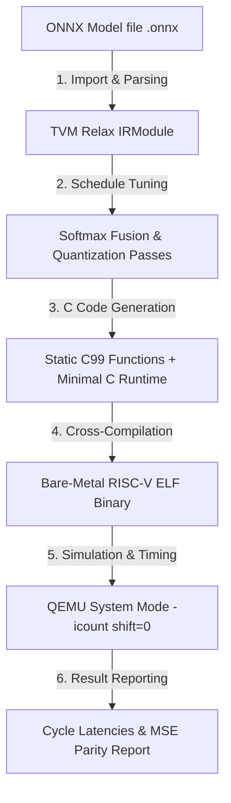

# TATVA System Architecture & Design Overview

This document provides a technical overview of TATVA's compiler pipeline architecture, TVM extension trade-offs, internal module map, and target hardware abstraction layer.

---

## 1. Compiler Pipeline Architecture

TATVA compiles high-level ONNX Transformer models into standalone C99 static functions linked with TVM's Minimal C Runtime for bare-metal RISC-V targets.



### Pipeline Stages Breakdown:
1. **Model Import & Parsing (`compiler.py`):** Imports `.onnx` model graphs into TVM Relax IRModules using `tvm.relax.frontend.onnx.from_onnx`.
2. **Schedule Optimization (`optimizer.py`):**
   - **Softmax Fusion:** Replaces standard 4-pass heap-allocated Softmax loops with Schraudolph's single-pass register-based fast exponential approximation.
   - **Dynamic Quantization:** Inserts Quantize-Dequantize (QDQ) operators to compress weights from FP32 to 8-bit dynamic INT8 representation.
3. **C Code Emission (`runner.py`):** TVM C-target codegen emits freestanding static C functions and header files (`model_run.c`, `weights.h`).
4. **RISC-V Cross-Compilation (`runner.py`):** Invokes `riscv-none-elf-gcc` with target-specific ABI flags (`-march=rv64gc -mabi=lp64d -O3`) and links with OpenSBI bare-metal firmware (`link.ld`).
5. **Deterministic Emulation & Timing (`runner.py`):** Runs the compiled ELF binary in `qemu-system-riscv64` with `-icount shift=0` and captures hardware cycle counters (`rdcycle`).

---

## 2. Technical Decision & Trade-Off Analysis: Extending Apache TVM

Instead of writing a proprietary C/C++ compiler framework from scratch, TATVA extends **Apache TVM**.

| Design Axis | Extending Apache TVM (TATVA Choice) | Writing Custom IR Compiler |
| :--- | :--- | :--- |
| **Frontend Support** | Native ONNX graph importer out-of-the-box (`from_onnx`). | Must write custom ONNX/PyTorch graph parsers and type inference. |
| **Target Codegen** | Uses TVM's C codegen target (`target="c"`), emitting standalone C99. | Must write custom C/C++ or LLVM IR codegen backends. |
| **Bare-Metal Support** | Native Minimal C Runtime (`microTVM`) with zero dynamic heap dependencies. | Must write custom memory managers and bare-metal runtime libraries. |
| **Custom Optimization** | Schedule mutators (`relax.PyExprMutator`) allow clean operator pattern replacement. | Requires writing custom IR transformation passes. |
| **Trade-Off / Complexity** | Large dependency footprint (`apache-tvm`); mitigated via lazy imports. | Harder maintenance, high development overhead. |

---

## 3. Core Module Map

| Module Path | Primary Responsibility |
| :--- | :--- |
| `src/tatva/compiler.py` | Model importing (`import_model`), graph analysis (`analyze_graph`), and target variant registry (`TARGETS`). |
| `src/tatva/optimizer.py` | Schedule optimizations (`fuse_attention_softmax`), dynamic quantization (`quantize`), and `compare_configs`. |
| `src/tatva/runner.py` | C codegen, RISC-V GCC cross-compilation (`compile_model`), QEMU simulation, and cycle timing (`establish_baseline`). |
| `src/tatva/diagnostics.py` | Failure classification (`classify_failure`), metadata whitelist gating (`whitelist_payload`), and Claude API / offline explanation engine (`explain`). |
| `src/tatva/config.py` | Centralized environment variable secret loader (`get_anthropic_api_key`, `get_resend_api_key`, `get_supabase_key`, `mask_secret`). |
| `src/tatva/_cache.py` | Session-level LRU cache storing content-hashed `ModelIR` instances and compilation build artifacts. |
| `src/tatva/logging_setup.py` | Configures module loggers, verbosity levels (`-v`, `-vv`, `--debug`), JSON logging, and secret masking (`SecretMaskingFormatter`). |
| `src/tatva/cli.py` | Click command-line interface entry points (`doctor`, `analyze`, `baseline-test`, `optimize`, `diagnose`, `gui`). |
| `src/tatva/gui.py` | Standalone multi-panel desktop engineering GUI application (`tatva gui`). |

---

## 4. Target Hardware Abstraction Layer

Target variants are represented by the `TargetVariant` data structure in `src/tatva/compiler.py`:

```python
@dataclass(frozen=True)
class TargetVariant:
    name: str
    march: str
    mabi: str
    abi: str
    description: str
    tvm_target: str
    has_vector: bool = False
    experimental: bool = False
```

This isolates hardware-specific compiler flags (`-march`, `-mabi`), TVM codegen targets, and QEMU CPU parameters from the core optimization pipeline.
